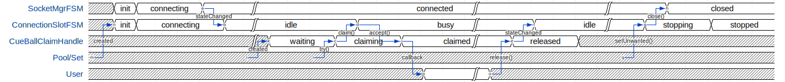

:toc: left
:numbered:
:data-uri:

# Cueball Internals

## Introduction

The interface that `cueball` presents to the outside world (in the form of its
public API) is a very high-level abstraction over a lot of detail. Managing
pools of connections correctly and efficiently is a complex and highly stateful
task, involving many possible races and edge conditions. This document is
intended to serve as a guide to the internal design of `cueball` and an
overview to help you understand how the pieces fit together.

## Components

### Logical services and backends

Many parts of `cueball` deal with the concept of a "logical service". This is
a uniquely named entity (usually a DNS name) that is used to refer to a
service offered to the network by potentially many processes running on many
machines.

For example, `(_dns._udp.)binder.staging-1.joyent.us` is a logical service that
provides DNS (over UDP), under the unique name `binder.staging-1.joyent.us`.
There may be only one physical machine providing this logical service, or there
may be many, and on each physical machine there may be multiple processes
providing it, or just one.

Each process on each machine that provides the service is referred to as a
"backend" for that logical service. A backend is uniquely identified within
a given logical service by the tuple of network (IP) `address` and `port`.

### Connections

In the `cueball` API, a "connection" is not necessarily a TCP socket. It can be
any EventEmitter that provides some kind of logical connection to a given
backend, as long as it obeys a similar interface to a socket.

This is intended to allow users of the API to represent a "connection" as an
application or session layer concept. For example, it could be useful to
construct a pool of connections to an LDAP server that perform a bind
operation (authenticate) before they are considered "connected".

The user of the `cueball` API passes in a "constructor" function which, when
called, must return a new connection object that has begun an attempt to
connect.

The API documentation includes the details of what is required in implementing
this interface.

### Connection pools

In the public API, `cueball` presents the `ConnectionPool`. Users construct
one of these to connect to some logical service by its name. Then they call
`.claim()` to "claim" a connection from the pool, use it, and release it by
calling `.release()` on the `handle` they were given with it.

The job of the `ConnectionPool` is to take in a set of backends and manage a set
of connections to them such that `claim()` requests may be fulfilled in a timely
manner.

The simplest possible `ConnectionPool` implementation would do nothing until
its `.claim()` function is called. Then it would construct a single connection
just for that claim, and immediately close it after `.release()` was called.

This would be inefficient, as every request has to pay the cost of connection
setup, and connection re-use (e.g. via keep-alive) is impossible.

The `cueball` connection pool is based around a policy of keeping "spares" --
connections that are already open and ready for use before a claim is made. The
process of claiming then triggers the pool to construct additional spares to
keep the population of idle connections at a constant level.

In this way, the pool has a certain amount of slack to respond quickly to
changes in demand, while minimizing the latency of claims.

Keeping spare connections also allows the pool to notice changes in the health
of backends for the logical service, so that it can mark failing backends early
and prevent them from unnecessarily passing errors back to client code. If
`cueball` is aware that a backend is "dead", it will not attempt to hand out
connections to it, avoiding immediate failure of requests that could have gone
to healthy backends instead.

### Connection sets

Another component of the public API is the `ConnectionSet`. This exists
primarily to provide the Moray client with a more minimalistic interface to
`cueball` than the fully-fledged pool.

Moray connections are multiplexed: they support multiple concurrent users on
the same underlying socket and interleave traffic related to each. As a result,
it doesn't make a lot of sense to maintain more than one connection to the same
backend (it's single-threaded anyway), and the pool mechanic of a single
claimer making the connection "busy" is not as useful.

So, the connection set API was added, designed to be broadly similar to a pool
but with some important modifications:

 * There is no claim-tracking -- connections become part of the pool and then
   eventually leave, but are never "busy" or "idle".
 * At most one connection to each backend is made at a time.
 * The client is expected to keep track of whether connections are "in use"
   or not and deal with draining them at the Set's behest.

Connection sets and pools share a lot of common components, including the full
set of connection management finite state machines.

### Finite state machines

Many other codebases that deal with connection management in node.js struggle
with uncontrolled growth of implicit state kept in chains of callbacks and
closure variables. The `cueball` library attempts to deal with this by
making component state explicit using finite state machines.

This text does not attempt to provide a reference for FSM design and
terminology, as there are many better such texts already available.

The https://github.com/joyent/node-mooremachine[`mooremachine`] framework is
used to provide runtime support for these FSMs, including debugging features
like recent state history in core dumps, and DTrace probes on state transition.

This framework has some idioms associated with it that are atypical for general
node.js code. They can be seen exhibited in the
https://github.com/joyent/node-mooremachine/blob/master/README.adoc[framework's documentation].

## Connection pool components

### Slots

A connection pool has to obtain and track connections to each backend. In order
to do this while dealing with disconnections, retries and timeouts, it uses a
concept of "connection slots".

A slot is associated with one particular backend. There may be more than one
slot "pointing" at this same backend across the whole pool, but a given slot
points at only one.

A slot may, depending on its state, provide at most one connection to the pool
that is ready for use. It may not be providing such a connection at the present
time, however, due to the fact that it may still be attempting to connect,
retrying after a failure, or may be still be claimed by a user.

Slots are important because they track the state of a logical connection even
when it is not currently connected, and thus enable planning based on an
expected future state of the pool.

### The rebalancer

Whenever a connection enters or leaves the pool or a claim is made, the pool
may react in some manner -- by changing the number of slots that are running,
or by replacing a slot pointing at one backend with a slot pointed at another.

To decide what action should be taken, the pool engages its "rebalancer", which
consists of a function on the pool combined with a planner function in
the shared `utils.js` file.

The rebalancer computes what a desirable set of slots for the pool to reach is,
based on the current situation, and the pool finds the easiest way to reach
that desired state.

To do this, it can create new slots (pointed at chosen backends), and it
can mark existing slots as "unwanted".

When a slot is marked as "unwanted", it indicates to the slot that it should
cease operation at its earliest convenience. Once the slot has stopped, the
rebalancer will engage again and complete any leftover work (e.g. adding a
replacement for the slot it marked).

### Claim handles

When a claim request comes into the pool, it must be associated with an
available connection to fulfill the claim. It may be the case that such a
connection is already available in the pool, or it may be that the claim will
have to be placed on a queue to await future availability.

To track the state of the claim process, the pool creates a "claim handle". The
"claim handle" attempts to interact with the slot that manages the connection
to establish the claim. If it fails, the pool examines it again, repeating the
process until the claim is fulfilled.

It is possible for the pool to match up a claim handle with a slot that is about
to become unavailable (as its connection is broken but the event hasn't yet
been processed). This also results in the claim handle returning to the pool to
be matched with a different slot and connection.

### Low-pass filter

Creating connections and accepting them on the backend side can be expensive,
and for that reason it is often desirable to avoid tearing down a connection
that has a good chance of being re-used.

To avoid wasted time spent shrinking connection pools, a low-pass filter is
used to bound the minimum number of slots present in the pool at any given time.
If long-term demand for connections from the pool remains high, the number of
slots will be kept higher than usual rather than being reduced once connections
are released.

### Error handling and monitor mode

When a connection experiences an error, the pool may react in several ways,
depending on its error recovery policy.

Generally, a certain number of "retries" is allowed. While there are retries
remaining, the connection slot and its socket manager are the components
responsible for attempting to re-connect. An exponentially increasing "timeout"
and "delay" value will be used for each subsequent attempt.

Once all of the "retries" have been used up by a given slot, it will move to the
"failed" state and wait for the connection pool to intervene.

At this point, the connection pool will mark the backend the slot was pointing
at as "dead". It will then proceed to take several steps:

 * All other slots pointed at this same backend will be stopped, by setting
   their "unwanted" flags
 * A replacement will be sought for these connections, from the remaining
   backends available within the logical service.
 * Once the old slots have been stopped, a single slot will be created in
   "monitor mode" pointed at the dead backend. This slot has infinite retries,
   all at the maximum timeout and delay values configured.

The "monitor" slot's purpose is to monitor the backend, in case it comes back
online and is ready for use again. If it ever succeeds in connecting to the
backend, the pool will remove the "dead" marking from that backend and attempt
to return to its original configuration of slots.

### Failed state

If all of the available backends within a logical service are marked as "dead"
(as explained in the previous section), the connection pool moves to the
"failed" state.

In the "failed" state, all attempts to claim a connection from the pool fail
immediately ("short circuit"), and all queued claim handles at the time are
cleared out, calling their callbacks with errors.

The pool will remain in the "failed" state until one of its "monitor" slots
manages to connect to a backend again.

### Coherence and decoherence

In a large distributed system with many clients on different machines attempting
to use the same logical service, a phenomenon we will refer to as "coherence"
can emerge.

For example, let us think about a situation where 5 clients all want to make 2
connections to a logical service with 4 backends (A through D). Let's suppose
all the backends are currently running, and each client picks 2 of the 4 at
random. We might see the following distribution:

.Initial state
|===
|          | Slot 1    | Slot 2

| Client 1 | Backend A | Backend B

| Client 2 | Backend C | Backend D

| Client 3 | Backend C | Backend A

| Client 4 | Backend B | Backend D

| Client 5 | Backend A | Backend B

|===

This is fairly even loading (3 on A, 3 on B, 2 on C, 2 on D). But we may not
produce such an even distribution in reality (the random number generator does
not always produce such perfect results).

The first kind of coherence that can occur is when the *initial* random choices
of the whole group of clients result in them "ganging up" or concentrating their
connections upon some subset of the available backends. We call this "static"
coherence.

There is a second kind of coherence which can occur as well: start by supposing
that backend B goes offline. Using the mechanisms above, we retry until we
exhaust our retry policy and mark backend B as dead on all clients. Then we
seek a replacement for it from the remaining entries on our list of backends.
Our final configuration might end up looking like this:

.State after losing backend B
|===
|          | Slot 1    | Slot 2

| Client 1 | Backend A | Backend D

| Client 2 | Backend C | Backend D

| Client 3 | Backend C | Backend A

| Client 4 | Backend A | Backend D

| Client 5 | Backend A | Backend D

|===

Now we have 4 on A, 2 on C and 3 on D. Backend A is no longer fairly loaded.
Additionally, let us suppose backend B comes back online. Without the "monitor"
mode we discussed above, a simplistic pool implementation would just continue
to use this set of slots and have no connections made at all to backend B.

If we restarted B as the first step in a "rolling restart" of all 4 backends,
now what we will see is that the clients concentrate all their connections onto
the exact backend we're about to restart next as we go around (because it's the
backend that has been up and running the longest!). This means that we are
guaranteed to produce the maximum possible disruption to these clients by doing
such a rolling restart -- we would disrupt their workload for less time if we
just restarted everything at once. This is clearly not a good result.

These are both examples of the second kind of coherence: "dynamic" coherence,
caused by the pool's reaction to changes in the environment (as opposed to being
caused by its static configuration).

As we've just observed, the slot monitor mode (discussed above) mitigates
against the most common form of dynamic coherence -- the monitor slots will
notice that backend B is back again, and the pools will change back to their
original configuration, removing the coherence.

The way this is implemented in cueball is by using a "preference list". This is
a randomly ordered list of all the backends available in the logical service.
Being higher up this list (closer to index 0) means that backend is "preferred"
for being used by this pool. The pool will attempt to get to its configured
number of slots by working its way down this list from most to least preferred
(taking into account dead markings as it goes).

To mitigate against static coherence, and the other more subtle kinds of dynamic
coherence, cueball makes use of a "decoherence" or "shuffle" timer. This timer
goes off every 60 seconds, and triggers the pool to take the least preferred
backend on its preference list and inject it back into the list at a random
higher index.

This means that the probability that a given timer firing will change the active
set of connections when there are N slots and M total backends is N/(M - 1)
footnoteref:[,Since the decoherence timer's primary objective is protection
against static coherence, it makes sense to have the expected time between it
causing changes in the active set of slots go up as the number of logical
backends in the service goes up -- with a larger number of logical backends
available it is less likely for static coherence to occur as the probability of
choosing the same small set from the larger set many times goes down. To our
knowledge this does not make it less effective at guarding against the other
kinds of dynamic coherence, such as during a partial outage, because these seem
to have a similar property.]. Such a change is carried out by the rebalancer as
part of its normal operation, by marking slots for the old backend as unwanted
and creating new slots.

Having this shuffling of preference lists take place periodically creates a
maximum expected time bound on how long a coherence event can last -- when one
does occur at random, the decoherence timer will eventually cause the clients to
go their separate ways and it will not persist indefinitely. It also lowers the
probability of severe coherence events occuring.

### ConnectionSet logical connections

In the `ConnectionSet` implementation, there is one more additional FSM in use:
the `LogicalConnection` FSM.

The API for sets has particular rules about when the `'added'` and `'removed'`
events about a "connection key" must be emitted, and the time at which to
generate a new connection key for a slot. These special rules are implemented in
the states of the `LogicalConnection`, which wraps around a slot and claim
handle.

A logical connection is created as soon as each slot is created in the
connection set. As soon as the slot is ready to contribute a connection to the
set, the logical connection handles the events over that connection's lifetime.
The logical connection's life ends when the underlying socket has disconnected
and the user of the set API has released the claim handle.

After a logical connection has stopped, the set decides whether to create a new
one for that slot or not, and the process starts again.

## In detail: the connection FSMs

Up until now, we have discussed the slot as if it was a single FSM. In actual
fact, in the code, it consists of two interacting FSMs, the `ConnectionSlotFSM`
and the `SocketMgrFSM`.

The two state machines start at the same time (`ConnectionSlotFSM` constructs
a `SocketMgrFSM` in its constructor and starts it), and operate in tandem.

The `SocketMgrFSM` takes care of the details of socket management and event
handling, as well as the implementation of exponential back-off and retry
counting. This division of labor allows the `ConnectionSlotFSM` to focus on
the higher-level logic of processing the information it gets from the pool
(via flags like the "unwanted" flag) and any open claim handles.

When the `SocketMgrFSM` reaches a state where it has no active connection
(e.g. its `'error'` or `'closed'` states), it stops and waits for direction
from the `ConnectionSlotFSM`. This direction comes in the form of signal
functions that are called on it by the `SlotFSM`.

The `SlotFSM` determines whether the `SocketMgrFSM` should `retry()` (meaning
to perform exponential back-off and use up an increment of the "retries"
counter), or simply attempt to `connect()` again.

Both these two FSMs, and the claim handle FSM (`CueBallClaimHandle`) reside in
the `connection-fsm.js` file. Their state transition diagrams are placed
in block comments above each constructor.

### Handle-slot interactions

Similarly to the way in which the `SocketMgrFSM` and `ConnectionSlotFSM`
operate in tandem, waiting for signal function calls to decide how to proceed,
the claim handle and slot FSM also interact.

When claim handles are constructed, they begin life in the "waiting" state,
while they wait for their pool to pair them up with a slot FSM. To propose a
pairing, the pool calls the `.try()` method on the claim handle.

Once `.try()` (a signal function) is called, the claim handle calls `.claim()`
on the given slot FSM (also a signal function) to attempt the claim.

If the slot FSM accepts the claim and is ready for use, it moves itself to state
"busy" and calls the `.accept()` signal function on the claim handle.

If the slot FSM rejects the claim (because e.g. the connection has already
been closed in the interim), it calls the `.reject()` signal function instead,
and the claim handle returns to state "waiting".

This double-handshake mechanism ensures the correct handling of race conditions
around claiming of a connection that is in the process of closing down due to
error.

.Timing diagram showing handle-slot interactions

An example timing diagram showing a typical transition pattern of these
interacting FSMs is shown in the figure. We can see a SocketMgrFSM, a
ConnectionSlotFSM and a related ClaimHandle from their creation to their
finalization.

The claim handle in the figure successfully claims the slot, then later
releases it cleanly. The pool's rebalancer then decides that the slot is now
unwanted, which triggers it to shut down.

Other transition patterns are possible when errors occur at various points
throughout the process.

## In detail: recovery policy and back-off

The policy surrounding retries and exponential back-off is specified in the
`cueball` public API using "recovery objects".

The simplest possible recovery object is shown below (<<recovery-simple>>).

[[recovery-simple]]
.A simple recovery object
[source,json]
------------------------------------------------------------------------------
{
	"default": {
		"retries": 3,
		"timeout": 1000,
		"delay": 100
	}
}
------------------------------------------------------------------------------

The top level of the recovery object has keys that correspond to a particular
action that can be taken by the `cueball` library. The value that corresponds
with each key is an object specifying the retry and back-off policy parameters
for that action.

If no specific policy object is present for a given action, the `"default"`
policy will be used instead.

In the case of the simple example above, all actions taken by `cueball` would
have a limit of 3 retries, an initial timeout of 1 second (1000 ms), and an
initial delay between retries of 100 ms.

Specifying 3 retries means that there will be a total of 3 attempts made before
declaring failure, with increasing timeout and delay: see <<attempts-simple>>.

[[attempts-simple]]
.Summary of attempts made for <<recovery-simple>>
[width="85%",options="header"]
|=============================================================================
| Attempt # | Timeout (ms)   | Delay before next attempt (ms)
| 1         | 1000           | 100
| 2         | 2000           | 200
| 3         | 4000           | 400
|=============================================================================

Assuming that all these attempts failed due to timeout, this would mean that
attempt #1 took place at `t = 0`, attempt #2 at `t = 1100`, #3 at `t = 3300`
and finally, the operation would be declared a failure at `t = 7700`.

The recovery mode slot that will be created following such a failure would
be initialized with infinite retries and the timeout and delay from the very
final attempt (4000 ms and 400 ms respectively in this example).
